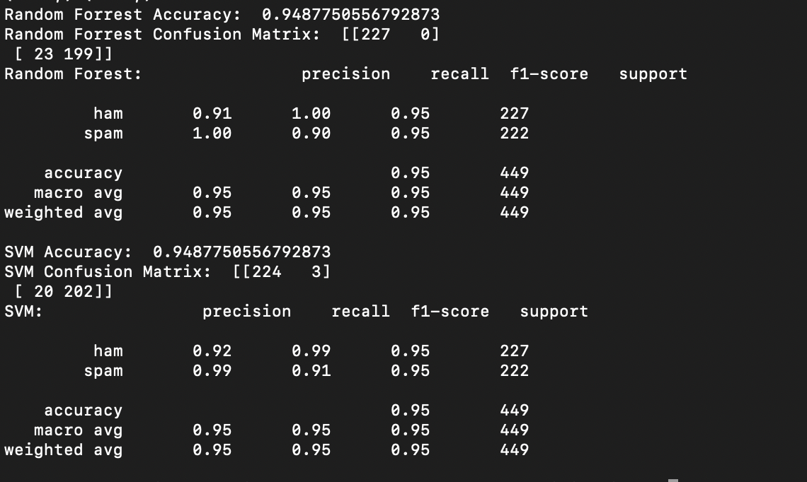

# Spam Classification Using Machine Learning

This project demonstrates a simple spam classification pipeline using two machine learning algorithms: **Random Forest** and **Support Vector Machines (SVM)**. The dataset consists of labeled messages categorized as either `spam` or `ham`. The project balances the dataset, vectorizes the text using TF-IDF, and evaluates both classifiers on precision, recall, F1-score, and accuracy.

## Features
- Dataset preprocessing, including balancing and cleaning.
- Implementation of **Random Forest** and **SVM** for spam classification.
- Evaluation metrics include accuracy, confusion matrix, precision, recall, and F1-score.
- Comparisons between the performance of the two classifiers.

## Dependencies
The following Python libraries are required:
- `numpy`
- `pandas`
- `matplotlib`
- `scikit-learn`

Install the dependencies using the following command:
```bash
pip install numpy pandas matplotlib scikit-learn
```

## Dataset
The dataset used is in a tab-separated `.tsv` format with two columns:
- `message`: The content of the message.
- `label`: The label indicating whether the message is `spam` or `ham`.

### Example Dataset
| message                     | label |
|-----------------------------|-------|
| "Free entry to win a prize" | spam  |
| "Are you available tonight" | ham   |

## Implementation Details
1. **Data Preprocessing**:
   - The dataset is balanced by sampling an equal number of `spam` and `ham` messages.
   - Missing values are removed.
   - Data is split into training and testing sets (70% training, 30% testing).

2. **Vectorization**:
   - The `TfidfVectorizer` is used to convert text into numerical features for machine learning models.

3. **Models**:
   - **Random Forest**:
     - A pipeline with TF-IDF vectorizer and `RandomForestClassifier` with 100 estimators.
   - **SVM**:
     - A pipeline with TF-IDF vectorizer and `SVC` classifier (`C=100`, `gamma='auto'`).

4. **Evaluation**:
   - Accuracy, confusion matrix, precision, recall, and F1-score are used to evaluate the models.

## Results
### Random Forest
- **Accuracy**: 94.88%
- **Confusion Matrix**:
  ```
  [[227   0]
   [ 23 199]]
  ```
- **Classification Report**:
  ```
                precision    recall  f1-score   support

           ham       0.91      1.00      0.95       227
          spam       1.00      0.90      0.95       222

      accuracy                           0.95       449
     macro avg       0.95      0.95      0.95       449
  weighted avg       0.95      0.95      0.95       449
  ```

### SVM
- **Accuracy**: 94.88%
- **Confusion Matrix**:
  ```
  [[224   3]
   [ 20 202]]
  ```
- **Classification Report**:
  ```
                precision    recall  f1-score   support

           ham       0.92      0.99      0.95       227
          spam       0.99      0.91      0.95       222

      accuracy                           0.95       449
     macro avg       0.95      0.95      0.95       449
  weighted avg       0.95      0.95      0.95       449
  ```

## How to Run
1. Clone this repository.
2. Place the `spam.tsv` dataset in the root directory.
3. Run the Python script:
   ```bash
   python main.py
   ```
4. The script will preprocess the data, train the models, and display the results.

## Conclusion
Both the Random Forest and SVM models achieve high accuracy (94.88%) on the test data. However, their performance differs in terms of precision and recall:
- Random Forest demonstrates perfect precision for `spam` but slightly lower recall.
- SVM provides balanced precision and recall for both classes.

This project demonstrates the effectiveness of machine learning in spam classification with relatively simple models and preprocessing steps.

